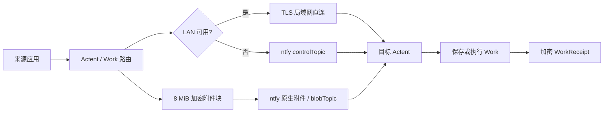

# Actent

[](https://github.com/wkzMagician/Actent/actions/workflows/ci.yml)

Actent 是一个跨设备的可编程内容路由器：把手机或电脑上的文字、链接和文件交给另一台设备保存、处理，再把执行结果送回来。

> 当前版本为 `0.0.1`，生产协议 v2 的业务传输链路已经接通；仍未包含 Push/APNs、用户注册、账户限流和套餐计费。发布前还需要完成真机验收与平台签名配置。

## 目录

- [Actent 做什么](#actent-做什么)
- [当前状态](#当前状态)
- [生产架构](#生产架构)
- [安全原则](#安全原则)
- [ntfy 服务器](#ntfy-服务器)
- [代码职责](#代码职责)
- [生产 v2 实现状态](#生产-v2-实现状态)
- [Push 与 APNs](#push-与-apns)
- [本地开发](#本地开发)
- [项目结构](#项目结构)

## Actent 做什么

一个典型流程如下：

```text
iOS / Android / Desktop 分享内容到 Actent
  -> 选择本机或远端 Work
  -> 同一局域网时优先直连，否则通过自建 ntfy 中转
  -> 目标设备保存内容或执行 Work
  -> WorkReceipt 返回发起设备
```

Actent 不把 ntfy 当成业务数据库。ntfy 只负责临时中转加密后的控制消息和附件块；Work、Inbox、设备关系和最终附件均由 Actent 在本地管理。

## 当前状态

### 仓库已有的基础

- Flutter 工程已声明 Android、iOS、Windows、macOS、Linux 和 Web 六个平台。
- 已有 ActentMessage、Work、Inbox、Receipt、持久化和路由等领域代码。
- Android 已有 `ACTION_SEND` / `ACTION_SEND_MULTIPLE` 输入与 FileProvider 输出。
- iOS 已有 Share Extension 和 App Group 文件导入链路，但仍使用模板标识符，不能直接作为正式发行配置。
- Desktop Script Work、Android Intent/HTTP Work 和 iOS URL/HTTP Work 已有实现或基础契约。
- 已有 X25519、HKDF、AES-GCM Packet 加密、附件分块、恢复和去重的基础实现。
- 已有 ntfy relay、TLS/LAN、配对以及对应的单元测试和 CI。

### 已实现的生产 v2

当前代码使用不兼容旧版的协议 v2：默认 relay 为 `https://actent.wkzmagician.top`，控制消息以 `text/plain` 发布加密 Packet；附件以 8 MiB 加密块使用 ntfy 原生附件或 LAN blob 传输；用户只配置原始 `tk_...` token。

首次启动 v2 会清除旧 relay 设置；旧协议设备需要重新配对。Work、Inbox 与本地附件继续保留。

## 生产架构



生产协议的固定规则：

| 项目 | 规则 |
| --- | --- |
| 协议版本 | v2，不兼容旧 relay 协议 |
| 网络选择 | LAN 优先，失败后使用 ntfy |
| 投递语义 | 至少一次投递，接收端按稳定 ID 幂等去重 |
| 离线窗口 | 7 天 |
| 单个原始附件 | 最大 2 GiB |
| 分块大小 | 8 MiB |
| ntfy 用法 | 控制消息走普通 publish；二进制块走原生附件 |
| Topic | 每台设备使用随机 `controlTopic` 和 `blobTopic` |
| Token | 每台设备一个 ntfy token，支持单独撤销 |
| 配对边界 | 一组已配对设备只信任同一个 relay，不跨 relay 配对 |

附件传输采用 `offer -> missing ranges/resume -> 上传加密块 -> chunkRef -> commit`。发送端与接收端都要持久化进度，应用重启后继续缺失块，而不是重新发送整个文件。

## 安全原则

- Packet、附件清单和附件内容均端到端加密；ntfy 和服务器管理员只能看到时间、大小和随机标识符。
- HTTPS 只保护传输过程，不能替代附件端到端加密。ntfy 会在 TLS 终止后保存附件，而且知道 URL 的人可能直接下载文件。
- 原始文件名、MIME、Work 内容和业务元数据只放在加密数据中，不写入 ntfy 的公开附件元数据。
- 用户在 Actent 中只粘贴原始 `tk_...` token；应用内部生成 `Authorization: Bearer ...`，界面不要求用户填写 Bearer 字段。
- token、设备私钥和 Work secret 只进入 Secure Settings；不得写入普通 JSON、日志、二维码或配对邀请。
- 控制 Packet 使用 `text/plain; charset=utf-8` 发布，避免 ntfy 把 Actent 的 Packet JSON 误当成 ntfy publish API 命令；附件字节使用 `application/octet-stream`。

## ntfy 服务器

生产 relay 为 [https://actent.wkzmagician.top](https://actent.wkzmagician.top)。服务器当前已经具备：

- 域名、HTTPS 和 Caddy 反向代理；
- 禁止匿名发布和订阅；
- `actent` 服务用户与 `actent-*` topic 读写 ACL；
- 7 天消息缓存；
- ntfy 原生附件，单文件 15 MB、总空间 5 GB、7 天过期；
- `behind-proxy` 配置与已认证的消息/附件冒烟测试。

8 MiB 的加密块低于服务器 15 MB 单附件限制。2 GiB 原始文件会拆成多份 ntfy 原生附件，而不是尝试上传一个 2 GiB 文件。

仍需补齐生产运维：为每台设备签发和撤销独立 token、备份 ntfy 数据和配置、磁盘/证书/服务监控、升级流程、日志轮转，以及恢复演练。任何真实 token 都不得提交到仓库。

## 代码职责

Actent 由 Flutter 应用与 [Dartloom](https://github.com/wkzMagician/dartloom) 通用能力包共同组成。

### Dartloom 负责

生产重构会把当前混合的 messaging 包拆为：

- `dartloom_messaging`：Packet、加密、附件 blob/reference、分块、恢复、去重和传输状态机的通用契约；
- `dartloom_messaging_ntfy`：ntfy 发布、订阅、鉴权和原生附件适配；
- `dartloom_messaging_lan`：TLS/LAN 发现与传输适配；
- `dartloom_pairing`：设备身份、邀请、确认和配对契约。

Dartloom 不理解 ActentMessage、Work、Inbox，也不保存 Actent 的业务数据。

### Actent 负责

- Work、Inbox、Catalog、Receipt 和本地数据模型；
- LAN 优先、ntfy 回退的业务路由策略；
- ntfy 设置、设备与 token 的业务映射；
- 传输状态的具体持久化；
- Android/iOS Share、桌面脚本和各平台 UI；
- 在 `lib/app` 中组合 Dartloom 契约与平台实现。

## 生产 v2 实现状态

以下是当前生产范围，**不包含 Push/APNs**。

### 1. 重构通用传输层

- [x] 在 Dartloom 中完成 messaging 契约与 ntfy、LAN adapter 的拆包。
- [x] 定义并测试协议 v2 的 Packet、offer、resume、chunkRef 和 commit Schema。
- [x] 删除 Actent 内的重复 relay adapter，由应用层组合通用 adapter。

### 2. 接通生产 ntfy

- [x] 把默认生产 server 改为 `https://actent.wkzmagician.top`，同时允许测试环境覆盖。
- [x] 设置页改为只输入 server URL 和原始 `tk_...` token；Bearer header 由代码生成。
- [x] 每台设备生成独立的随机 control/blob topic，并验证其 ACL。
- [x] 控制消息改为精确保留 Packet 的 text publish，附件改为原生二进制 attachment upload。

### 3. 完成加密附件和断点续传

- [x] 把现有 256 KiB、Base64、Packet 内嵌分块替换为 8 MiB 加密二进制块。
- [x] 加密 manifest、原始文件名、MIME 与每个块，并校验顺序、长度和认证标签。
- [x] 持久化发送/接收状态，重启后只补缺失区间。
- [ ] 全部块校验完成后再原子提交到 Inbox；失败和过期传输可安全清理。
- [x] 实现 2 GiB 单附件上限、7 天离线窗口和空间不足等明确错误。

### 4. 完成可靠投递

- [x] 实现持久化待发送队列、重试退避、确认和 7 天过期策略。
- [ ] 以稳定消息/请求/块 ID 做幂等去重，满足“至少一次发送、业务只执行一次”。
- [x] LAN 发送失败后无缝切换 ntfy，且不会重复创建 Work 或 Inbox 项。
- [ ] 完成取消、过期、配对撤销和 token 失效时的状态收敛。

### 5. 收紧配对和密钥边界

- [x] 配对只交换设备公钥、随机 topic 和非秘密 endpoint 信息，不传 token 或私钥。
- [ ] 拒绝跨 relay 配对，并为 relay 变更提供明确的重新配对流程。
- [ ] 取消配对后撤销设备授权、终止待处理请求并保留用户历史。

### 6. 完成应用端生产配置

- [ ] 将正式标识符改为 `top.wkzmagician.actent`、`top.wkzmagician.actent.ShareExtension` 和 `group.top.wkzmagician.actent`。
- [ ] 修正 Android application ID、iOS 签名/App Group、macOS/Windows/Linux 打包元数据。
- [ ] 区分测试与生产 relay、token、topic 和数据目录，禁止测试凭据进入正式包。
- [ ] 保留 Work、Inbox 和本地附件，执行一次性的 v2 relay/配对迁移清理。

### 7. 验收和运维

- [ ] 覆盖 Packet、附件、恢复、重复投递、断网、重启、过期、撤销和权限失败测试。
- [ ] 完成 iOS 真机 Share -> ntfy -> server/desktop -> receipt 双向验收。
- [ ] 完成 Android、Desktop 和跨网环境的端到端验收。
- [ ] 为服务器建立备份、监控、告警、升级和 token 生命周期操作手册。

## Push 与 APNs

当前版本不接入 APNs、Firebase Cloud Messaging 或 OneSignal，也不维护 Push provider 后端。ntfy 是可靠数据源，但在 iOS 应用没有运行时，系统不会保证 Actent 的网络连接继续存活，因此当前版本不承诺后台即时唤醒或系统通知；用户打开 Actent 后再从 ntfy 补齐 7 天窗口内的数据。

- [ ] 延期项：确实需要后台即时提醒时，再增加 provider-neutral 的 Dartloom Push 契约，并把 APNs、FCM 或 OneSignal 做成可替换 adapter。

Push 只发送“有新数据”的最小提示，真实消息仍从 ntfy 拉取，不能把 Apple/Google/OneSignal 变成业务数据源。

## 本地开发

CI 使用 Flutter `3.47.0`。先安装对应平台的 Flutter 工具链，然后执行：

```powershell
flutter pub get
flutter run -d windows
```

Linux：

```bash
flutter pub get
pwsh ./tool/run_linux.ps1
```

iOS 必须在 macOS/Xcode 环境构建；Share Extension 由项目的 post-build hook 编译。

提交前运行：

```text
dart format .
flutter analyze
flutter test
```

若修改 Dartloom 包，还需要在每个被修改的包目录执行 `dart format .`、`dart analyze` 和 `dart test`。

## 项目结构

```text
lib/app/                    应用组合、平台条件选择和共享 glue
lib/features/actent_core/   ActentMessage、Work、Inbox、路由与持久化
lib/features/messaging/     当前传输桥接代码；v2 后仅保留 Actent 业务适配
lib/features/pairing/       Actent 配对流程与 UI 适配
lib/features/work/          Desktop、Android、iOS Work runner
android/ ios/               系统分享、原生 channel、签名与平台 glue
schemas/                    版本化 ActentMessage Schema
test/                       单元、组件和端到端测试
tool/                       平台运行与构建脚本
```
