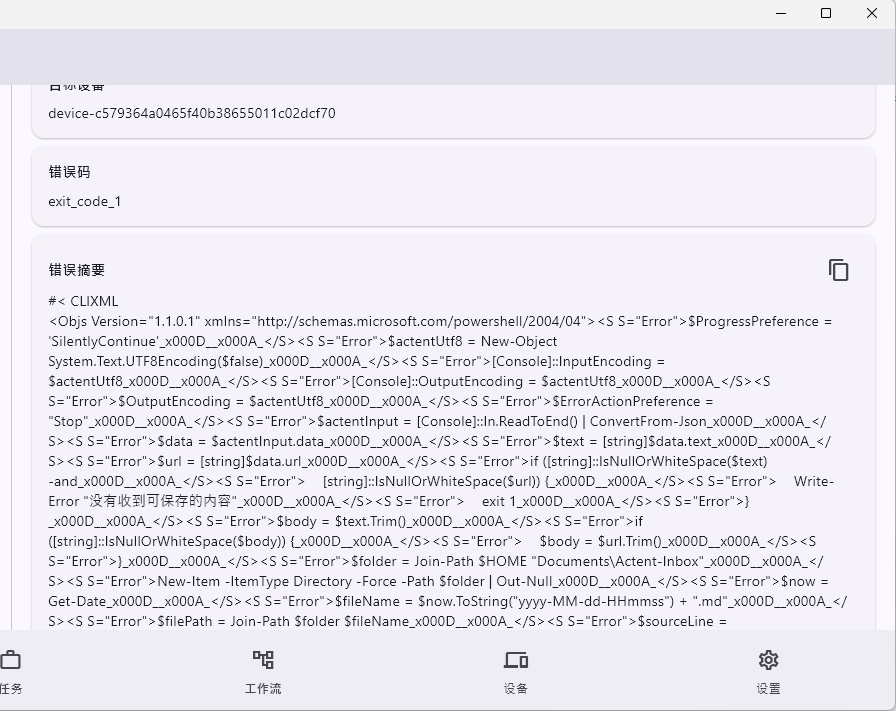

# TODO

## BUG

[x] 从手机向电脑发送的任务，两端显示的错误原因不同：手机：

电脑：

核心原因是电脑脚本有问题？但是手机收不到正确的错误信息，只会显示 "No runner is registered restart."

[x] 现在从剪贴板/用应用打开/分享，打开Actent，会弹出一个选择框。即使用户选择“丢弃”或者点击空白处让选择框消失，仍然会产生一个activity，显示“正在发送中”，这是非常不合理的。

## FEATURE

[x] 现在冷启动应用要加载好几秒，速度太慢了

[x] 消息也要区分任务和工作流

[x] 消息（任务/工作流）是否应当只在发送方处显示？

[x] json 输入应当是一个类似于代码编辑器，而不是文件选择

[x] 手机上的图片选择，应该打开“照片”而不是“文件”

[x] “工作流”页面和“任务”页面不同。工作流独属于单个设备，且不会发送给配对的设备
